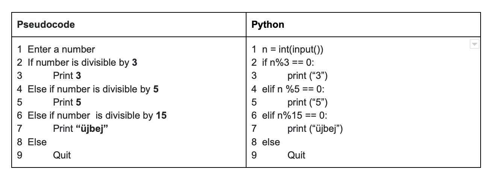

# uejbej
Basic-Python

# How I did:

# What I learnt:

are you using jupyterLite? if so you'll need to use int(await input(…)) since their input function returns a future

[see also] https://github.com/jupyterlite/jupyterlite/issues/275)

<h1 align= "center"> Hi there!</h1>

My name is Gülsah, I'm currently working on:

- my personal website 🦦
- Python 👩‍💻

I **love** learning about creative coding, so don't hesitate to say hi!

- [Linkedin](https://www.linkedin.com/in/zahide-gulsah-durmaz/)

